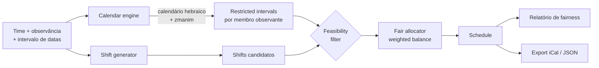

<div align="center">

# shomer-oncall

**Rotação de plantão (on-call) ciente do calendário hebraico, que respeita Shabbat e Yamim Tovim - com boundaries calculados a partir de *zmanim* astronômicos, não de uma lookup table chumbada, e uma divisão comprovadamente justa da carga entre observantes e não-observantes.**

[](#)
[](#)
[](#)
[](LICENSE)
[](docs/TESTING.md#4-contrato-de-determinismo)

</div>

---

## TL;DR

`shomer-oncall` gera uma rotação de plantão para um time em que alguns membros observam Shabbat e feriados judaicos (*Yamim Tovim*) e outros não. Ele garante que **nenhum observante seja paginado durante um período em que não pode responder**, mantendo a carga total de plantão **justa** no time inteiro ao longo de uma janela móvel.

Os dois problemas difíceis que ele resolve com honestidade:

1. **Quando exatamente começa e termina um período restrito?** Shabbat começa no pôr do sol (com um buffer costumeiro) e termina no anoitecer (*tzais hakochavim*) - ambos são **eventos astronômicos que dependem de latitude, longitude, elevação e data**. Este projeto os calcula a partir de um modelo solar, não de uma tabela estática que apodrece em silêncio.
2. **O que significa "justo" quando algumas pessoas não podem pegar os slots de maior demanda?** Se observantes são simplesmente excluídos de sexta à noite e sábado, os não-observantes absorvem todo fim de semana para sempre. `shomer-oncall` define fairness como um objetivo explícito e mensurável (balanceamento de weighted load) e compensa o lado restrito nos shifts que ele *pode* pegar.

> *Shomer* (שומר) significa "guardião" / "aquele que guarda [o Shabbat]". O nome é a spec.

---

## Sumário

- [Por que existe](#por-que-existe)
- [O que não é](#o-que-não-é)
- [Início rápido](#início-rápido)
- [Como funciona (60 segundos)](#como-funciona-60-segundos)
- [Exemplo](#exemplo)
- [Mapa da documentação](#mapa-da-documentação)
- [Princípios de design](#princípios-de-design)
- [Status do projeto](#status-do-projeto)
- [Licença](#licença)

---

## Por que existe

Schedulers de plantão (PagerDuty, Opsgenie, Grafana OnCall) modelam "estou indisponível" como um override manual que você cola toda semana. Isso é frágil:

- O engenheiro observante tem que lembrar de bloquear **todo** Shabbat e **todo** Yom Tov, incluindo os que se movem (o calendário hebraico é lunisolar), os festivais de dois dias da diaspora e os dias de jejum.
- Um fim de semana bloqueado simplesmente é repassado para o próximo da fila - não há **contabilidade** do fato de que as mesmas três pessoas não-observantes agora cobrem toda sexta à noite do ano.
- O boundary de indisponibilidade é digitado como uma hora de relógio ("18:00") que está **errada na maior parte do ano** e errada para quem viaja.

`shomer-oncall` trata a observância como uma **constraint de primeira classe do domínio**, deriva os boundaries a partir de primeiros princípios e torna o trade-off de fairness resultante **visível e auditável** em vez de escondido.

## O que não é

- **Não** é um sistema de paging. Ele produz um schedule; você alimenta esse schedule no seu pager existente (adapters de export para PagerDuty/Opsgenie/iCal estão no [roadmap](docs/ROADMAP.md)).
- **Não** é uma autoridade haláchica. Ele calcula *zmanim* de uso comum com opiniões configuráveis (*shitot*) e documenta exatamente qual fórmula usa (ver [DOMAIN.md](docs/DOMAIN.md#5-opiniões-de-zmanim-shitot)). O *psak* da sua comunidade vence - a opinião é um parâmetro, não um hard-code.
- **Não** faz phone-home, não exige conta e não precisa de credenciais de nuvem. É uma computação local determinística.

## Início rápido

```bash
# Requer Python 3.11+ - e nada mais. Zero dependências de runtime.
pip install shomer-oncall            # ou rode do source: PYTHONPATH=src python -m shomer_oncall

# Gera um schedule para o Q1 2026 a partir de um arquivo de time (locations ficam no arquivo)
shomer-oncall schedule \
  --team ./examples/team.json \
  --from 2026-01-01 \
  --to   2026-03-31 \
  --out  out/schedule.ics \
  --gate

# Explica um boundary (por que o Shabbat termina no horário que termina naquele dia?)
shomer-oncall explain-boundary \
  --date 2026-06-13 \
  --location "America/Sao_Paulo:-23.55:-46.63:760"

# Audita a fairness de um schedule gerado
shomer-oncall fairness --schedule out/schedule.json --team ./examples/team.json
```

Veja [docs/CLI.md](docs/CLI.md) para a referência completa de comandos.

## Como funciona (60 segundos)



1. O **calendar engine** transforma o intervalo de datas em restricted intervals concretos por membro observante, usando sua location e a *shitah* escolhida.
2. O **shift generator** fatia o intervalo em shifts (configurável: handoff diário, semanal, follow-the-sun).
3. O **feasibility filter** remove pares (membro, shift) em que o membro está restrito em qualquer parte do shift.
4. O **fair allocator** atribui os shifts minimizando um objetivo de desbalanceamento de weighted load sujeito às constraints de feasibility e coverage.
5. Os **reporters** emitem o schedule mais um scorecard de fairness e um audit trail completo.

Detalhe completo: [ARCHITECTURE.md](docs/ARCHITECTURE.md) e [ALGORITHMS.md](docs/ALGORITHMS.md).

## Exemplo

`examples/team.json` (JSON é o default zero-dependency; YAML funciona com o extra opcional `yaml`):

```json
{
  "team": "platform-sre",
  "diaspora": true,
  "members": [
    { "id": "rivka", "observes": ["shabbat", "yom_tov"],
      "location": "America/Sao_Paulo:-23.55:-46.63:760", "shitah": "mga_16.1" },
    { "id": "dan", "observes": ["shabbat", "yom_tov"],
      "location": "Asia/Jerusalem:31.78:35.22:754", "shitah": "gra_8.5", "diaspora": false },
    { "id": "alex", "observes": [], "location": "America/Sao_Paulo:-23.55:-46.63:760" },
    { "id": "sam", "observes": [], "location": "Europe/London:51.51:-0.13:35" }
  ]
}
```

Rodar a ferramenta neste time para o Q1 2026 imprime (saída real):

```
Relatório de fairness de plantão  ·  window: 2026-01-01 -> 2026-03-31 (90d)
--------------------------------------------------------------
membro      weighted load    share   Δ vs igual
alex                33.00    25.6%        +2.3%
dan *               32.00    24.8%        -0.8%
rivka *             32.00    24.8%        -0.8%
sam                 32.00    24.8%        -0.8%
--------------------------------------------------------------
Jain fairness index      : 1.000
Gini coefficient         : 0.006
Weighted spread          : 1.00
Gap observer/non-observer: 1.55%
Coverage                 : 100%  ·  violations: 0
Shifts uncovered         : 0
(* = membro observante)
```

Note que `rivka` e `dan` (os observantes) carregam **a mesma weighted load que `sam`**, mesmo pegando zero shifts de sexta à noite/sábado - o allocator os compensou em slots de dia de semana e domingo. Esse equilíbrio é o ponto central, e é [medido](docs/METRICS.md), não afirmado.

## Mapa da documentação

| Documento | O que você encontra |
|---|---|
| [docs/ARCHITECTURE.md](docs/ARCHITECTURE.md) | Views C4 context/container/component, diagramas de sequência e state, fronteiras de módulos |
| [docs/DOMAIN.md](docs/DOMAIN.md) | Calendário hebraico, *zmanim*, regras de boundary de Shabbat/Yom Tov, domain model + ERD |
| [docs/ALGORITHMS.md](docs/ALGORITHMS.md) | Cálculo de boundary e o algoritmo de fair allocation, com pseudocódigo, complexidade e edge cases resolvidos |
| [docs/METRICS.md](docs/METRICS.md) | Fairness (Jain, Gini, spread), coverage e métricas de constraint com suas definições exatas |
| [docs/OBSERVABILITY.md](docs/OBSERVABILITY.md) | Logs, métricas, traces; RED/USE; o audit trail |
| [docs/TESTING.md](docs/TESTING.md) | Pirâmide de testes, property-based tests, golden fixtures e o contrato de determinismo |
| [docs/CLI.md](docs/CLI.md) | Referência completa de comandos |
| [docs/SECURITY.md](docs/SECURITY.md) | Threat model, tratamento de dados, supply chain |
| [docs/GLOSSARY.md](docs/GLOSSARY.md) | Todo termo de domínio, definido uma vez |
| [docs/ROADMAP.md](docs/ROADMAP.md) | O que vem a seguir e o que está explicitamente fora de escopo |
| [docs/adr/](docs/adr/) | Architecture Decision Records - o *porquê*, não só o *o quê* |

## Princípios de design

1. **Determinismo é feature.** Mesmos inputs → saída byte-idêntica. É um contrato testável, não uma aspiração. Ver o [contrato de determinismo](docs/TESTING.md#4-contrato-de-determinismo).
2. **Todo boundary é explicável.** `explain-boundary` mostra o evento solar, a *shitah*, o buffer e o instant UTC resultante. Sem números mágicos.
3. **Fairness é definida, depois medida.** "Parece justo" não é métrica. Comprometemo-nos com uma função objetivo e reportamos contra ela.
4. **A opinião haláchica é um parâmetro.** O engine traz defaults mas nunca hard-coda um *psak*.
5. **Read-only por padrão.** A ferramenta calcula e reporta; nunca muta seu pager sem um passo explícito de export.

## Status do projeto

Implementação funcional com zero dependências de runtime, suíte de testes (77 testes, ~96% de coverage), ruff + mypy-strict limpos, e o conjunto completo de documentação. Ver [ROADMAP.md](docs/ROADMAP.md) para os próximos marcos.

## Licença

[MIT](LICENSE).
