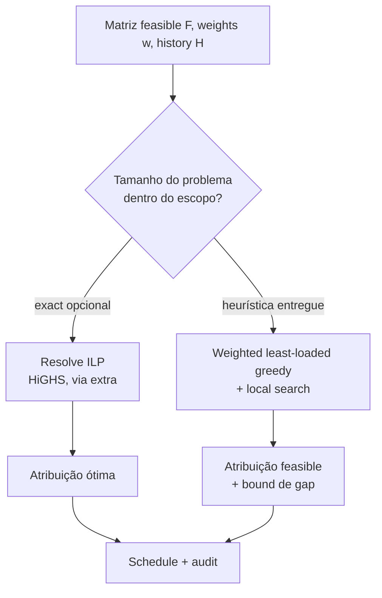

# Algoritmos

> Os dois algoritmos que sustentam o projeto: **cálculo de boundary** (transformar
> um intervalo de datas em restricted intervals por membro) e **fair allocation**
> (atribuir shifts minimizando o desbalanceamento de weighted load sujeito a
> constraints hard). O pseudocódigo é neutro de linguagem; complexidade e edge cases
> são declarados em cada um.

- [1. Notação](#1-notação)
- [2. Cálculo de boundary](#2-cálculo-de-boundary)
- [3. Geração de shifts e o load model](#3-geração-de-shifts-e-o-load-model)
- [4. Feasibility](#4-feasibility)
- [5. Alocação](#5-alocação)
- [6. Tratando shifts uncoverable](#6-tratando-shifts-uncoverable)
- [7. Complexidade](#7-complexidade)
- [8. Exemplo resolvido](#8-exemplo-resolvido)

---

## 1. Notação

| Símbolo | Significado |
|---|---|
| `M` | conjunto de membros, `|M| = n` |
| `S` | conjunto ordenado de shifts na window, `|S| = k` |
| `w(s)` | load weight do shift `s` (≥ 0) |
| `R(m)` | restricted intervals canônicos do membro `m` (sorted, merged) |
| `F ⊆ M × S` | pares feasible: `(m,s)` onde `s` não intersecta nenhum interval em `R(m)` |
| `x[m,s]` | variável de decisão ∈ {0,1}: membro `m` recebe o shift `s` |
| `L(m)` | weighted load atribuída de `m` = `Σ_s w(s)·x[m,s]` |
| `H(m)` | carry-in histórico de load (de windows anteriores) |
| `θ, b` | opinião de nightfall, candle-lighting buffer (por membro) |

## 2. Cálculo de boundary

Objetivo: para cada membro observante, produzir `R(m)` — uma lista canônica (sorted,
merged, não-adjacente) de intervals UTC em que ele não pode ser paginado.

```mermaid
flowchart TD
    A[Para o membro m, window W] --> B[Enumera dias hebraicos que sobrepõem W]
    B --> C{Dia é restrito<br/>para a observância de m?}
    C -->|não| B
    C -->|sim| D[Classifica: Shabbat / Yom Tov / ...]
    D --> E[vespera = data gregoriana cujo sunset inicia o dia]
    E --> F["start = shkiah(L, vespera) − buffer b"]
    D --> G[ultimo = data gregoriana cuja noite termina o período]
    G --> H["end = tzais(L, ultimo, θ)"]
    H --> I{tzais sem<br/>solução? (lat alta)}
    I -->|sim| J[fallback para a regra<br/>de fixed-minutes + flag no rationale]
    I -->|não| K[registra rationale:<br/>evento solar, θ, buffer]
    J --> K
    F --> L[interval = start..end]
    K --> L
    L --> M[coleta intervals]
    M --> N[ordena por start_utc]
    N --> O[funde sobrepostos/adjacentes]
    O --> P["R(m) canônico"]
```

Pseudocódigo:

```text
função restricted_intervals(m, window W):
    raw ← []
    para hday em dias_hebraicos_sobrepondo(W, diaspora=m.diaspora):
        se not is_restricted(hday, m.observes):        # classificação via hebrew.py
            continue
        vespera ← gregoriano_vespera_de(hday.period_start)
        ultimo  ← gregoriano_fim_de(hday.period_end)
        start   ← shkiah(m.location, vespera) − m.buffer
        (end, fellback) ← tzais(m.location, ultimo, m.shitah)
        rationale ← descreve(evento_solar, m.shitah, m.buffer, fellback)
        raw.append(Interval(start, end, hday.kind, rationale))
    return merge_adjacent(sort_by_start(raw))            # Invariante 3

função merge_adjacent(intervals):                         # intervals ordenados
    out ← []
    para iv em intervals:
        se out não-vazio e iv.start ≤ out.last.end:        # sobreposição OU encosta
            out.last.end ← max(out.last.end, iv.end)
            out.last.kind ← funde(out.last.kind, iv.kind)  # ex. yom_tov+shabbat
        senão:
            out.append(iv)
    return out
```

**Notas de corretude**

- `dias_hebraicos_sobrepondo` deve incluir o dia *anterior* a `W.start` se a noite
  dele se estende para dentro de `W` — o dia hebraico começa no pôr do sol da
  véspera ([DOMAIN §2](DOMAIN.md#2-o-calendário-hebraico-o-que-o-código-precisa-saber)).
  A implementação faz padding de um dia de cada lado e clipa no fim.
- `merge_adjacent` usa `≤` (não `<`) para que intervals que apenas *se tocam* (Yom
  Tov terminando exatamente quando o buffer do Shabbat começa) ainda se fundam.
- O caminho de fallback do `tzais` é o único branch que *parece* não-determinístico;
  é determinístico dado (location, data, opinião) e tem
  [property test](TESTING.md#3-property-based-tests) de monotonicidade: uma opinião
  mais stringent nunca gera um `end` mais cedo.

**Complexidade:** `O(d · C)` por membro, onde `d` = dias na window e `C` = custo de
um cálculo de evento solar (constante). O merge é linear no número de dias restritos.
Para `n` membros: `O(n · d · C)`.

## 3. Geração de shifts e o load model

A geração de shifts fatia `W` conforme a `schedule_policy`:

| Policy | Fatia | Handoff |
|---|---|---|
| `daily` | 1 dia | hora fixa (UTC) |
| `weekly` | 7 dias | dia/hora fixos |
| `follow_the_sun` | blocos sub-diários por região (roadmap) | nas bordas de região |

O **load model** atribui a cada shift um weight `w(s) ≥ 0` refletindo quão pesado
ele é. Weighting default (tudo configurável):

```
w(s) = base
     × (weekend_mult   se s cai em Fri/Sat/Sun else 1)
     × (holiday_mult   se s cobre um company holiday else 1)
```

Por que ponderar? Porque "todo mundo fez 20 shifts" **não** é justo se três dessas
pessoas fizeram todo fim de semana. A fairness tem que ser medida em *carga*, não em
contagem — é o cerne do projeto, formalizado em [METRICS.md](METRICS.md#2-weighted-load).
A base do weight é registrada em cada shift para o audit trail.

## 4. Feasibility

```text
função feasible(m, s):                # s = interval do shift
    para iv em R(m):                  # ordenados; dá para binary-search
        se intervals_intersectam(s, iv):
            return false
    return true

F ← { (m,s) : m ∈ M, s ∈ S, feasible(m,s) }
```

**Feasibility é um hard filter.** Um par que falha aqui nunca pode ser atribuído,
independente da pressão de fairness — isto garante a [Invariante 1](DOMAIN.md#9-invariantes).

## 5. Alocação

**Objetivo.** Atribuir cada shift a exatamente um membro feasible de modo que as
weighted loads *cumulativas* fiquem o mais iguais possível. Formalmente, um integer
program:

```
minimizar    Z = maxₘ (H(m) + L(m)) − minₘ (H(m) + L(m))     # weighted spread
sujeito a    Σₘ x[m,s] = 1                    ∀ s ∈ S         # exactly-one (coverage)
             x[m,s] = 0                        ∀ (m,s) ∉ F    # feasibility
             x[m,s] ∈ {0,1}
onde         L(m) = Σ_s w(s)·x[m,s]
```

Minimizar o spread max−min é uma formulação de **min–max fairness**.

### Duas regimes de solução ([ADR-0006](adr/0006-estrategia-de-alocacao.md))



**Heurística (default entregue, zero-dependency).** Weighted least-loaded greedy
(shift mais pesado primeiro, tie-break estável) seguido de local search:

```text
função greedy_allocate(S, F, w, H):
    load ← copy(H)                                  # começa do carry-in
    assign ← {}
    para s em sort(S, key=(−w(s), s.id)):           # mais pesados primeiro, estável
        cands ← { m : (m,s) ∈ F }
        se cands vazio: marca s Uncovered; continue
        m* ← argmin_{m ∈ cands} (load[m], m.id)     # menos carregado, id desempata
        assign[s] ← m*
        load[m*] += w(s)
    return local_search(assign, ...)                # swaps enquanto variância ↓
```

Atribuir os mais pesados primeiro é o que permite os observantes "compensarem": eles
são excluídos dos slots de fim de semana, então o greedy joga esses para quem tem
folga, e depois entrega os slots pesados de dia de semana (que os observantes *podem*
pegar) a eles para equalizar. O local search polir o desbalanceamento residual.

**Exact (opcional, `--regime exact`).** Resolve o ILP de min–max spread com um solver
(ex. HiGHS) para um ótimo comprovável. Mantido atrás de um extra opcional para o
install core permanecer sem dependências.

**Determinismo.** Ambas as regimes são determinísticas: o greedy ordena com chaves de
ordem total (`(−w, id)`, `(load, id)`) então não há ambiguidade de empate nem de
iteração de set. Exigido pelo [contrato de determinismo](TESTING.md#contrato-de-determinismo).

### Carry-in de histórico

`H(m)` semeia a load de cada membro com o que ele já carregou em windows anteriores,
então a fairness é avaliada sobre um **rolling horizon**, não resetada a cada
trimestre. A flag `--history` fornece as loads anteriores; ausente, `H(m) = 0`.

## 6. Tratando shifts uncoverable

Um shift é *uncoverable* quando seu conjunto feasible é vazio — ex. um time todo
observante num Yom Tov de 2 dias na diaspora. A ferramenta **não** inventa cobertura.
Em ordem de prioridade, configurável:

1. **Falhar (default).** Reporta o shift uncovered, exit code `3`. O default seguro:
   nunca paginar quem não pode responder, e nunca fingir que um slot está coberto.
2. **Backup pool.** Se um roster `backup:` (ex. um time parceiro) estiver
   configurado, puxa dele e rotula a atribuição como `backup`.
3. **Relaxamento de soft-restriction.** Se (e só se) o time optar, slots de `fasts` e
   `chol_hamoed` podem ser preenchidos com um membro deprioritizado e sinalizado —
   nunca `shabbat`/`yom_tov`, que permanecem hard.

Todo caminho é registrado no audit trail com sua razão, então um gap uncovered é uma
decisão visível, não um buraco silencioso.

## 7. Complexidade

| Stage | Tempo | Espaço | Notas |
|---|---|---|---|
| Cálculo de boundary | `O(n · d · C)` | `O(n · d)` | `C` = um evento solar; `d` = dias |
| Geração de shifts | `O(k)` | `O(k)` | |
| Matriz de feasibility | `O(n · k · |R|)` | `O(|F|)` | |
| Alocação — greedy+LS | `O(k log k + |F| + I·|F|)` | `O(|F|)` | `I` = iterações do local search |
| Alocação — exact | ILP; ms–s para tamanhos no escopo | `O(|F|)` | HiGHS; ótimo |
| Metrics | `O(n + k)` | `O(n)` | |

Para um time de 20 pessoas numa rotação diária de 90 dias: `n=20`, `d≈90`, `k≈90`,
`|F| ≤ 1800`. Tudo confortavelmente sub-segundo.

## 8. Exemplo resolvido

Time: `rivka`, `dan` (observam Shabbat+Yom Tov), `alex`, `sam` (sem restrições).
Window: uma semana, policy `daily`, `weekend_mult = 2.0`, resto `1.0`.

Shifts e weights (Fri/Sat ponderados 2.0):

| Shift | Dia | w |
|---|---|---|
| s1 | Seg | 1.0 |
| s2 | Ter | 1.0 |
| s3 | Qua | 1.0 |
| s4 | Qui | 1.0 |
| s5 | Sex | 2.0 |
| s6 | Sáb | 2.0 |
| s7 | Dom | 1.0 |

Feasibility: `rivka`/`dan` são infeasible para `s5` (Sex, restritos a partir do pôr
do sol) e `s6` (Sáb). Peso total = 9.0; share igual = 2.25 cada.

Atribuição ótima (min spread): `alex`←s5, `sam`←s6, `rivka`←s1+s3, `dan`←s2+s4, e o
shift ímpar de domingo `s7` vai para `rivka` (tie-break determinístico) → loads
`alex 2.0, sam 2.0, rivka 3.0, dan 2.0`, spread `1.0`. Os observantes `rivka`/`dan`
carregam `3.0`/`2.0` apesar de pegarem **zero** shifts de fim de semana — as loads de
dia de semana os equilibraram contra o plantão de fim de semana dos não-observantes.
É o objetivo de fairness fazendo o seu trabalho, e [METRICS.md](METRICS.md) mostra
como é pontuado.
