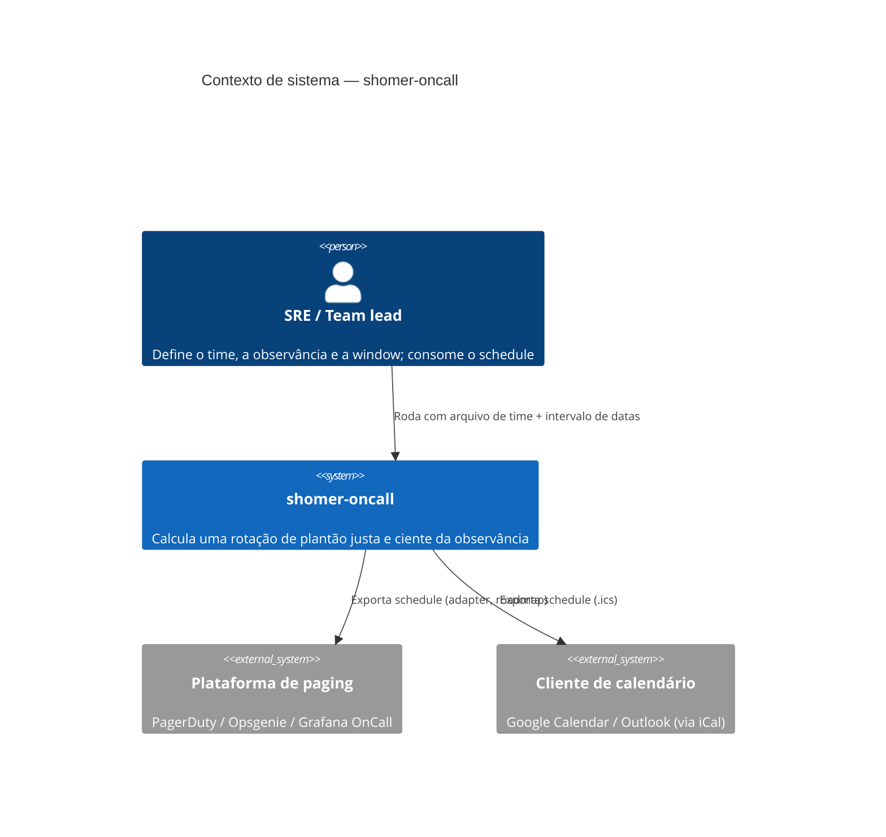
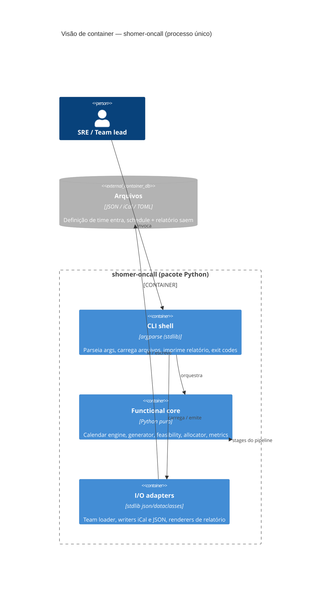
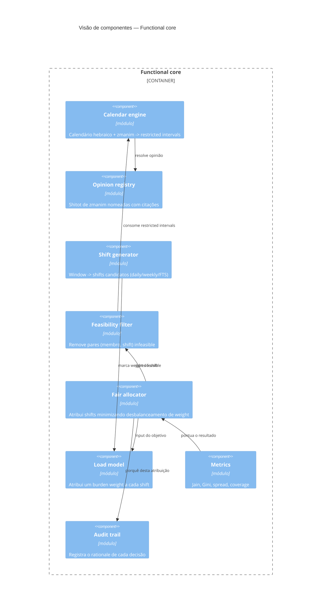
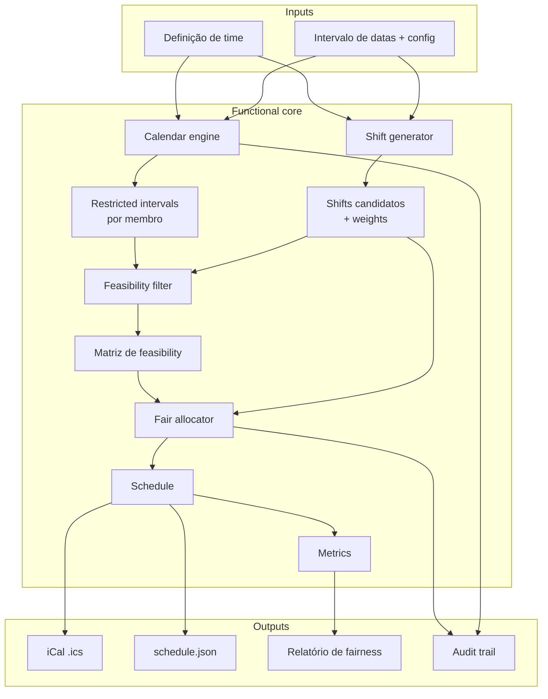
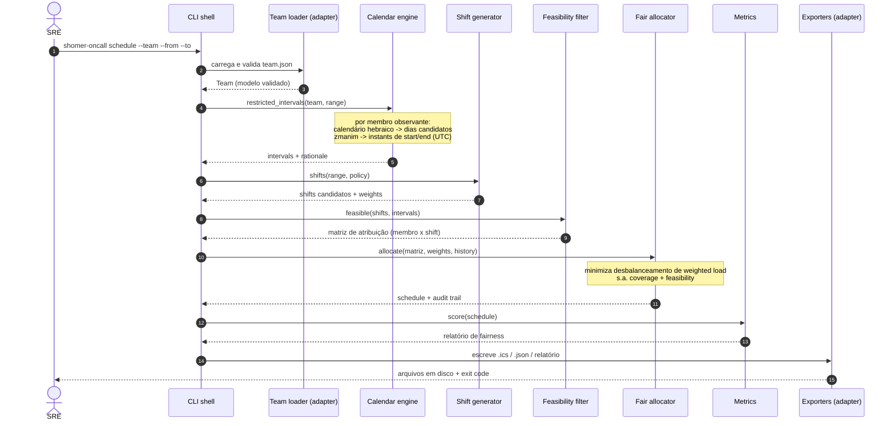
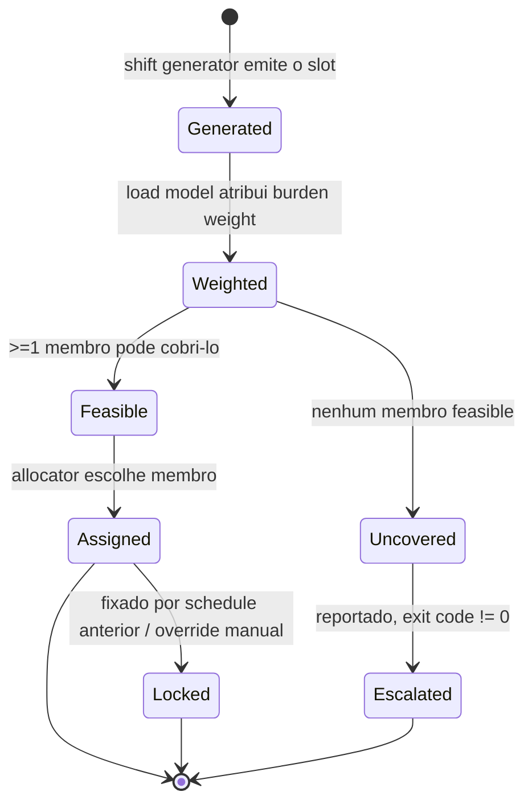
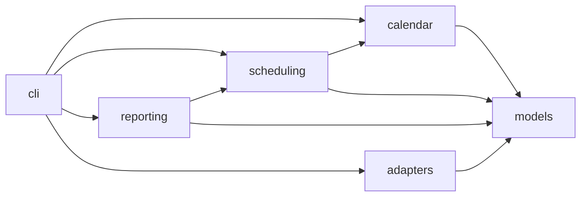

# Arquitetura

> Como o `shomer-oncall` é estruturado, por que os boundaries caem onde caem, e
> como um schedule flui pelo sistema. Os diagramas são Mermaid e renderizam no
> GitHub. Para o *porquê* de escolhas específicas, ver os [ADRs](adr/).

- [1. Visão geral](#1-visão-geral)
- [2. Atributos de qualidade](#2-atributos-de-qualidade-o-que-o-design-otimiza)
- [3. C4 — Nível 1: Contexto de sistema](#3-c4--nível-1-contexto-de-sistema)
- [4. C4 — Nível 2: Containers](#4-c4--nível-2-containers)
- [5. C4 — Nível 3: Componentes (core)](#5-c4--nível-3-componentes-core)
- [6. O pipeline](#6-o-pipeline)
- [7. Visão de runtime: gerando um schedule](#7-visão-de-runtime-gerando-um-schedule)
- [8. Ciclo de vida do shift (state)](#8-ciclo-de-vida-do-shift-state)
- [9. Estrutura de módulos e dependências](#9-estrutura-de-módulos-e-dependências)
- [10. Cross-cutting concerns](#10-cross-cutting-concerns)
- [11. Trade-offs principais](#11-trade-offs-principais)

---

## 1. Visão geral

`shomer-oncall` é uma **computação batch determinística**, não um serviço. Recebe
uma definição de time e um intervalo de datas, e produz um schedule mais relatórios.
Não há banco de dados, nem daemon scheduler, nem dependência de rede em runtime. É
uma escolha deliberada — torna a ferramenta trivialmente testável, auditável e
embutível em CI (ver [ADR-0005](adr/0005-batch-stateless-vs-servico.md)).

A arquitetura é um **pipeline de funções puras** envolto por um shell fino de I/O
(o padrão *functional core, imperative shell*). Toda a incerteza de calendário/
astronomia é empurrada para um único boundary — o calendar engine — e tudo
downstream opera sobre intervals simples, já resolvidos.

## 2. Atributos de qualidade (o que o design otimiza)

| Prioridade | Atributo | Como a arquitetura o serve |
|---|---|---|
| 1 | **Corretude** | Fonte única de verdade para boundaries; opiniões são parâmetros explícitos; golden tests contra *zmanim* autoritativos. |
| 2 | **Determinismo** | Core puro, clock injetado, sort keys estáveis, sem leitura de relógio de parede na lógica. Ver [contrato de determinismo](TESTING.md#contrato-de-determinismo). |
| 3 | **Explicabilidade** | Todo boundary e toda atribuição carrega um rationale machine-readable (o audit trail). |
| 4 | **Testabilidade** | O functional core não tem I/O; os adapters são substituíveis; fixtures fixam casos do mundo real. |
| 5 | Portabilidade | Python puro, sem dependências de runtime; roda em qualquer lugar com Python, offline. |
| 6 | Performance | Não é meta de destaque, mas o allocator fica dentro de limites [documentados](ALGORITHMS.md#7-complexidade). |

Performance é intencionalmente baixa na lista: um trimestre de scheduling para um
time de 20 pessoas são milhares de intervals, não milhões. Corretude compra mais
que velocidade aqui.

## 3. C4 — Nível 1: Contexto de sistema



Não há **nenhum** sistema externo em runtime: o modelo solar é calculado in-house a
partir de primeiros princípios ([ADR-0002](adr/0002-zmanim-astronomico-vs-lookup-table.md)),
então não existe chamada ao vivo. O export para pager está tracejado por estar no
[roadmap](ROADMAP.md), não entregue.

## 4. C4 — Nível 2: Containers

Como isto é um único processo CLI, os "containers" aqui são unidades lógicas de
execução dentro de um binário, não serviços implantáveis.



Regra de fronteira: **o core nunca toca o filesystem, o relógio ou a rede.** Os
adapters fazem tudo isso e entregam value objects simples ao core. É o que torna o
core determinístico e unit-testável sem mocks.

## 5. C4 — Nível 3: Componentes (core)



Cada componente é um módulo com uma única responsabilidade. Os dados fluem numa
direção; não há ciclos (garantido em [§9](#9-estrutura-de-módulos-e-dependências)).

## 6. O pipeline

O sistema inteiro é um único pipeline direcionado. Cada stage é uma função pura
`stage(input, config) -> output`.



Se qualquer stage recebe inputs idênticos, produz saída idêntica — é a propriedade
que os [testes de determinismo](TESTING.md#contrato-de-determinismo) travam.

## 7. Visão de runtime: gerando um schedule



Os exit codes fazem parte do contrato (para funcionar como gate de CI): `0` sucesso,
`3` shift(s) uncovered, `4` fairness abaixo do threshold, `5` input inviável. Tabela
completa em [CLI.md](CLI.md#exit-codes).

## 8. Ciclo de vida do shift (state)

Um shift passa por uma pequena máquina de estados explícita durante a alocação. É o
que o [audit trail](OBSERVABILITY.md#2-audit-trail) registra as transições.



`Uncovered` nunca é descartado em silêncio. Se o conjunto feasible de um shift é
vazio (ex. um time todo observante diante de um Yom Tov de dois dias sem policy de
cobertura), a ferramenta **falha alto** em vez de paginar quem não pode responder.
Mitigações estão documentadas em [ALGORITHMS.md](ALGORITHMS.md#6-tratando-shifts-uncoverable).

## 9. Estrutura de módulos e dependências

```
src/shomer_oncall/
├── cli.py                 # imperative shell (argparse)
├── models.py              # value objects (dataclasses): Member, Shift, Interval, Schedule
├── pipeline.py            # liga os stages puros (sem I/O)
├── config.py              # SchedulePolicy, thresholds
├── calendar/
│   ├── engine.py          # restricted_intervals(team, range)
│   ├── zmanim_opinions.py  # opinion registry (shitot) + citações
│   ├── hebrew.py          # aritmética do calendário hebraico (Hillel)
│   ├── astronomy.py       # modelo solar (sunset / tzais)
│   └── holidays.py        # classificação Yom Tov / fast (diaspora-aware)
├── scheduling/
│   ├── generator.py       # shifts candidatos
│   ├── weights.py         # load model
│   ├── feasibility.py     # matriz (membro, shift)
│   └── allocator.py       # atribuição justa
├── reporting/
│   ├── metrics.py         # Jain / Gini / spread / coverage
│   └── audit.py           # records de rationale
└── adapters/
    ├── team_loader.py     # JSON -> Member[]
    ├── ical_writer.py     # Schedule -> .ics
    └── json_writer.py     # Schedule -> json
```

**Direção de dependência (deve permanecer acíclica):**



`models` é a folha da qual todos dependem e que não depende de nada interno. Os
pacotes do core (`calendar`, `scheduling`, `reporting`) nunca importam `cli` nem
`adapters`.

## 10. Cross-cutting concerns

| Concern | Abordagem |
|---|---|
| **Tempo** | Um `Clock` é injetado nos adapters, nunca lido dentro do core. Todos os instants internos são UTC timezone-aware; hora local existe só nas bordas para exibição. Ver [ADR-0004](adr/0004-utc-interno-localizar-nas-bordas.md). |
| **Config e opiniões** | Validadas uma vez no load (parsing estrito nos adapters). A *shitah* é resolvida para um objeto de cálculo concreto no opinion registry — sem branching por string downstream. |
| **Erros** | Erros de domínio são tipados (`InfeasibleScheduleError`, `UnknownShitahError`) e mapeiam para exit codes distintos. Adapters traduzem; o core levanta. |
| **Logging** | Saída de console mínima hoje; o **audit trail** (JSON machine-readable) é o registro autoritativo, e logging estruturado mais rico está no roadmap. Ver [OBSERVABILITY.md](OBSERVABILITY.md). |
| **Determinismo** | Sort keys estáveis em todo lugar onde um set/dict é iterado para output; nenhuma ordem de `set` vaza no resultado; clock/seed injetados. |

## 11. Trade-offs principais

1. **Batch vs serviço.** Escolhemos uma ferramenta batch stateless. Não faz push de
   overrides ao vivo, mas é determinística, testável e CI-friendly. Se swaps em
   tempo real virarem requisito, um serviço fino envolve o mesmo core — o core não
   muda. ([ADR-0005](adr/0005-batch-stateless-vs-servico.md))
2. **Otimização exata vs heurística.** O allocator entregue usa uma heurística
   determinística com objetivo documentado; um ILP exato é opcional, atrás de um
   extra de dependência. ([ADR-0006](adr/0006-estrategia-de-alocacao.md), [ALGORITHMS.md](ALGORITHMS.md#5-alocação))
3. **Modelo solar próprio vs serviço astronômico ao vivo.** Calcular in-house custa
   alguma precisão de longo horizonte mas compra determinismo offline e zero
   dependências externas. O error budget disso é quantificado em
   [METRICS.md](METRICS.md#5-acurácia-de-boundary). ([ADR-0002](adr/0002-zmanim-astronomico-vs-lookup-table.md))
4. **Opinião como parâmetro vs default opinativo.** Mais superfície de configuração,
   mas é a única escolha honesta: a ferramenta não pode impor um *psak*.
   ([ADR-0003](adr/0003-shitah-como-parametro.md))
