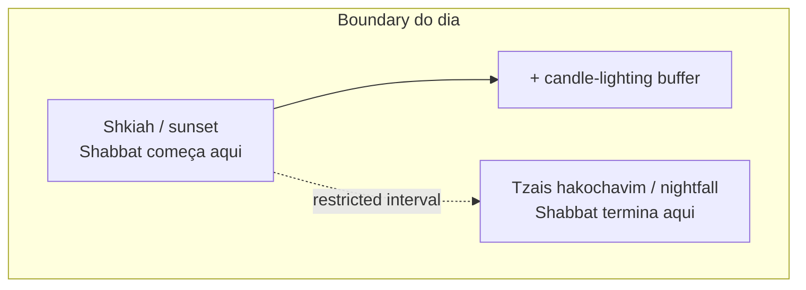
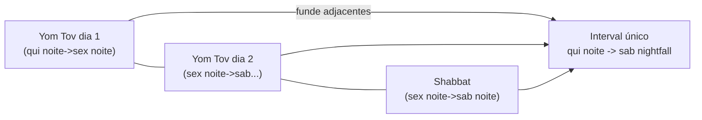
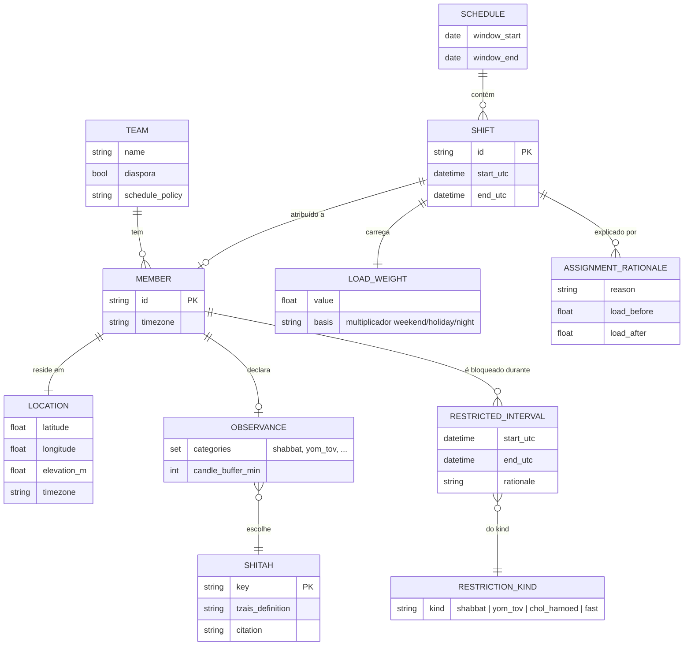

# Domain model

> O conhecimento de calendário hebraico e de *zmanim* que este sistema codifica,
> declarado com precisão suficiente para implementar e para discutir. Onde uma
> regra tem múltiplas opiniões válidas, isso é apontado explicitamente — a
> ferramenta toma a opinião como parâmetro, nunca como hard-code
> ([ADR-0003](adr/0003-shitah-como-parametro.md)).

- [1. O problema em termos de domínio](#1-o-problema-em-termos-de-domínio)
- [2. O calendário hebraico (o que o código precisa saber)](#2-o-calendário-hebraico-o-que-o-código-precisa-saber)
- [3. Períodos restritos](#3-períodos-restritos-o-que-bloqueia-um-slot-de-plantão)
- [4. Zmanim: transformando um dia em instants](#4-zmanim-transformando-um-dia-em-instants)
- [5. Opiniões de zmanim (shitot)](#5-opiniões-de-zmanim-shitot)
- [6. Regras de boundary, exatamente](#6-regras-de-boundary-exatamente)
- [7. Edge cases que o modelo precisa sobreviver](#7-edge-cases-que-o-modelo-precisa-sobreviver)
- [8. Entidades de domínio (ERD)](#8-entidades-de-domínio-erd)
- [9. Invariantes](#9-invariantes)

---

## 1. O problema em termos de domínio

Um membro **observante** do time não pode realizar trabalho (incluindo responder a
um page e agir sobre ele) durante o **Shabbat** e os **Yamim Tovim** (dias de
festival). Esses períodos não são janelas semanais fixas de relógio:

- Suas **datas de calendário** vêm do **calendário hebraico (lunisolar)**, que
  deriva contra o gregoriano e insere um mês bissexto em 7 de cada 19 anos.
- Seus **instants de início e fim** são **astronômicos** — atrelados ao pôr do sol
  e ao anoitecer na location exata do observador, que variam por data, latitude,
  longitude e elevação.

Então o domínio tem dois subproblemas: *quais dias* são restritos (calendário), e
*de quando a quando* nesses dias (astronomia). O código os separa de forma limpa.

## 2. O calendário hebraico (o que o código precisa saber)

O sistema não reimplementa o calendário via terceiros — implementa a aritmética de
Hillel em `hebrew.py`. Mas precisa modelar corretamente estes fatos:

- **Lunisolar.** Os meses seguem a lua (29–30 dias); anos bissextos adicionam um 13º
  mês (*Adar I*) para re-sincronizar com o ano solar. É por isso que uma data
  hebraica cai em uma data gregoriana diferente a cada ano.
- **O dia começa no pôr do sol.** O dia hebraico é **noite → manhã → tarde**. Uma
  "data", portanto, atravessa duas datas gregorianas. É a fonte número um de bugs
  de off-by-one e é tratada explicitamente ([§6](#6-regras-de-boundary-exatamente)).
- **Diaspora vs Israel.** Fora da terra de Israel, a maioria dos *Yamim Tovim* é
  observada por **dois dias** em vez de um. É uma configuração por time / por membro
  (`diaspora: true`). Errar isso sub-bloqueia em silêncio um observante no exterior.

## 3. Períodos restritos (o que bloqueia um slot de plantão)

As categorias que a ferramenta reconhece, cada uma configurável por membro via
`observes`:

| Categoria | Chave | Notas |
|---|---|---|
| Shabbat | `shabbat` | Todo pôr do sol de sexta → anoitecer de sábado. O caso de alta frequência. |
| Festivais maiores (Yom Tov) | `yom_tov` | Rosh Hashanah, Yom Kippur, Sukkot (dia 1–2 + Shemini Atzeret/Simchat Torah), Pesach (primeiro e último dias), Shavuot. Restringem trabalho como Shabbat. |
| Chol HaMoed | `chol_hamoed` | Dias intermediários de festival. Trabalho muitas vezes *permitido*; **off por padrão**, opt-in. |
| Fast days | `fasts` | Ex.: Tisha B'Av, Yom Kippur (também Yom Tov). Responder a um page geralmente é permitido; modelado como disponibilidade **soft** (deprioriza, não bloqueia) — off por padrão. |

Ponto de design: só `shabbat` e `yom_tov` bloqueiam por padrão, porque são as
categorias com consenso amplo de que agir sobre um page não é permitido. Tudo mais
brando é opt-in, então a ferramenta nunca *super*-restringe sem ser instruída.

## 4. Zmanim: transformando um dia em instants

*Zmanim* (זמנים, "tempos") são horas haláchicas derivadas da posição do sol. As
duas que delimitam Shabbat/Yom Tov:



- **Shkiah (sunset):** pôr do sol geométrico — o momento em que a borda superior do
  sol cai abaixo do horizonte real, corrigido por refração atmosférica e pela
  **elevação** do observador (mais alto ⇒ pôr do sol mais tarde).
- **Candle-lighting buffer:** por costume, entra-se no Shabbat *antes* do pôr do sol
  (comumente 18 min; 40 em algumas comunidades). A ferramenta inicia o restricted
  interval em `shkiah − buffer`, buffer configurável.
- **Tzais hakochavim (nightfall):** "quando as estrelas aparecem". Definido ou como o
  sol atingindo um **depression angle** abaixo do horizonte (ex. 8.5°) ou como um
  **número fixo de minutos** após o sunset. É o valor mais dependente de opinião no
  sistema, daí o [opinion registry](#5-opiniões-de-zmanim-shitot).

### Por que elevação e refração importam (e por que uma tabela não serve)

O pôr do sol em São Paulo (760 m) é materialmente mais tarde que ao nível do mar no
mesmo dia; uma lookup table indexada só por data+cidade chumba uma elevação e uma
suposição de refração e apodrece assim que alguém viaja. Calcular a partir de um
modelo solar torna os inputs explícitos e a saída explicável. É o argumento central
do [ADR-0002](adr/0002-zmanim-astronomico-vs-lookup-table.md).

## 5. Opiniões de zmanim (shitot)

Diferentes autoridades haláchicas (*poskim*) definem o mesmo *zman* de formas
diferentes. A ferramenta traz um registry de opiniões nomeadas; o membro escolhe uma
via `shitah`. Cada entrada carrega os parâmetros de cálculo **e uma citação**, para
que a escolha seja auditável.

| Chave da opinião | Definição de nightfall (*tzais*) | Uso típico | Notas |
|---|---|---|---|
| `gra_8.5` | Sol 8.5° abaixo do horizonte | Default moderno comum (escola do Vilna Gaon) | Ângulo ciente de elevação. |
| `gra_16.1` | Sol 16.1° abaixo do horizonte | Stringent (equivale a 72 min fixos no equinócio) | Nightfall mais tarde do conjunto comum. |
| `mga_16.1` | 72 minutos após o sunset (Magen Avraham) | Stringent, fixed-minute | MGA afeta principalmente o *dawn*; aqui pareado ao campo stringent. |
| `fixed_40` | 40 minutos fixos após o sunset | Simples, específico de comunidade | Para times cujo *psak* é um offset plano. |
| `rt_72` | Rabbeinu Tam (72 min, sol 16.1°) | Mais stringent | Restricted interval mais longo. |

Defaults: candle-lighting buffer `18 min`; nightfall `gra_8.5`. **São defaults, não
doutrina** — ver [ADR-0003](adr/0003-shitah-como-parametro.md). O registry é o
*único* lugar onde as opiniões vivem; nenhum módulo downstream faz branch por string
de *shitah*.

## 6. Regras de boundary, exatamente

Para um membro observante `m` na location `L` (lat, lon, elevação, tz), com buffer
`b` minutos e opinião de nightfall `θ`:

**Shabbat** na sexta gregoriana `F` cuja noite inicia o Shabbat:

```
start(m) = shkiah(L, F) − b minutos
end(m)   = tzais(L, F + 1 dia, θ)
```

**Yom Tov** abrangendo os dias hebraicos `d1..dk` (k = 1 em Israel para a maioria,
2 na diaspora; mais quando um festival encosta no Shabbat):

```
start(m) = shkiah(L, gregoriano_vespera_de(d1)) − b
end(m)   = tzais(L, gregoriano_fim_de(dk), θ)
```

**Merge de adjacência.** Quando Yom Tov cai numa sexta ou domingo, funde-se com o
Shabbat num **único restricted interval contínuo** (potencialmente ~72h na diaspora,
quinta à noite → sábado à noite). O engine **funde intervals sobrepostos/adjacentes**
para que o código downstream veja um interval, nunca dois se tocando. Esse merge é o
gerador clássico de bugs e tem [property tests](TESTING.md#3-property-based-tests)
dedicados.



Todos os instants são calculados e armazenados em **UTC**; a hora local é apenas uma
questão de exibição ([ADR-0004](adr/0004-utc-interno-localizar-nas-bordas.md)).

## 7. Edge cases que o modelo precisa sobreviver

Enumerados porque cada um já queimou algum scheduler ingênuo, e cada um tem teste.

| # | Caso | Por que é difícil | Tratamento |
|---|---|---|---|
| 1 | **Dia começa no pôr do sol** | Data hebraica atravessa duas datas gregorianas | Fórmulas de boundary partem da *véspera* explicitamente. |
| 2 | **Adjacência Yom Tov + Shabbat** | Dois/três dias restritos se fundem | Interval merge ([§6](#6-regras-de-boundary-exatamente)). |
| 3 | **Yom Tov de dois dias na diaspora** | Sub-bloqueio silencioso no exterior | Flag `diaspora` por membro/time. |
| 4 | **Ano bissexto (Adar I)** | Datas gregorianas dos festivais deslocam | Golden-tested ao longo de um ciclo de 19 anos. |
| 5 | **Latitude alta** | O sol pode não atingir o depression angle (sem nightfall real no verão) | O registry declara um fallback documentado (fixed-minute) e o rationale do boundary o sinaliza. |
| 6 | **Transição de DST dentro de um interval** | A hora de parede local salta | UTC internamente contorna isso; só a exibição localiza. |
| 7 | **Membros em fusos diferentes** | "Sexta à noite" difere por pessoa | O interval de cada membro é calculado na *sua* location; feasibility é por membro. |
| 8 | **Elevação** | Tabelas de nível do mar erram no interior/altitude | A elevação é parte obrigatória de `location`. |
| 9 | **Overlap fast day vs Yom Tov (Yom Kippur)** | As duas categorias se aplicam | Classificado como Yom Tov (bloqueia); a suavidade do fast não o rebaixa. |

O caso 5 (latitude alta) merece ênfase: a ferramenta nunca deve emitir um boundary
que não consegue justificar. Se o *tzais* angular escolhido não tem solução numa
dada data, o engine faz fallback para a regra de minutos declarada da opinião **e
registra essa substituição no rationale do boundary**, para aparecer no `explain-boundary`.

## 8. Entidades de domínio (ERD)



## 9. Invariantes

O seguinte deve valer para qualquer saída que a ferramenta emita. São afirmadas em
código e checadas por [property tests](TESTING.md#3-property-based-tests):

1. **Nenhuma violação.** Para todo par atribuído `(membro, shift)`, o interval do
   shift **não** intersecta nenhum restricted interval daquele membro. (Hard, nunca
   trocada por fairness.)
2. **Cobertura total ou falha explícita.** Todo shift ou é atribuído a exatamente um
   membro ou é reportado como `Uncovered` com exit code diferente de zero. Nenhum
   shift fica sem atribuição em silêncio.
3. **Canonicidade de intervals.** Os restricted intervals de um membro são
   par-a-par não-sobrepostos e não-adjacentes após o merge, ordenados por
   `start_utc`.
4. **Explicabilidade de boundary.** Todo restricted interval carrega um rationale que
   reconstrói seus endpoints a partir de (evento solar, opinião, buffer, qualquer
   fallback).
5. **Determinismo.** Inputs idênticos ⇒ `Schedule` idêntico (serialização
   byte-idêntica). Ver o [contrato](TESTING.md#contrato-de-determinismo).

Fairness deliberadamente **não** está nesta lista — é um *objetivo a otimizar* (ver
[METRICS.md](METRICS.md)), não uma invariante. As invariantes acima são invioláveis;
a fairness é maximizada sujeita a elas.
