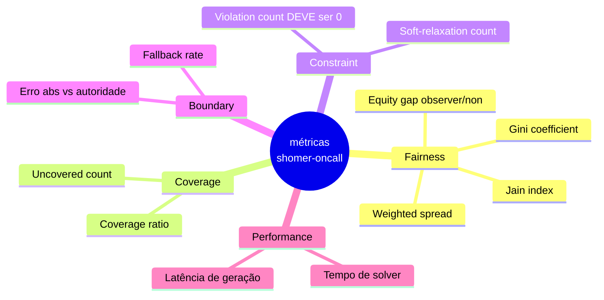
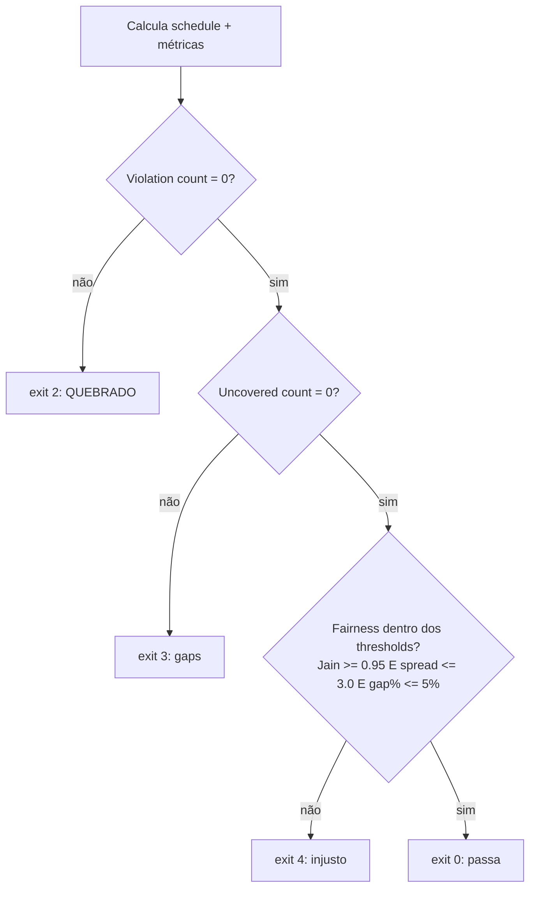

# Métricas

> Toda alegação de qualidade que este projeto faz é um número com definição. Este
> documento define cada métrica exatamente, declara sua faixa e alvo, e mostra como
> é calculada. Se uma métrica não está definida aqui, a ferramenta não a reporta.
>
> Princípio: **definir fairness, depois medir.** "Parece justo" não é métrica
> ([princípio de design 3 do README](../README.md#princípios-de-design)).

- [1. Famílias de métricas](#1-famílias-de-métricas)
- [2. Weighted load (a quantidade base)](#2-weighted-load)
- [3. Métricas de fairness](#3-métricas-de-fairness)
- [4. Métricas de coverage e constraint](#4-métricas-de-coverage-e-constraint)
- [5. Acurácia de boundary](#5-acurácia-de-boundary)
- [6. Métricas de performance](#6-métricas-de-performance)
- [7. SLOs e thresholds do gate de CI](#7-slos-e-thresholds-do-gate-de-ci)
- [8. Scorecard resolvido](#8-scorecard-resolvido)

---

## 1. Famílias de métricas



Quatro famílias respondem quatro perguntas: *A carga é dividida com justiça? Todo
slot está coberto? Alguma vez quebramos uma regra hard? Os tempos calculados estão
corretos?* Mais performance para operabilidade.

## 2. Weighted load

O átomo sobre o qual tudo é construído. Para o membro `m`:

```
L(m) = Σ_{s atribuído a m} w(s)          # w definido em ALGORITHMS §3
Ltot = Σ_m L(m)
share_igual = Ltot / n
share(m) = L(m) / Ltot
```

Medimos fairness em **weighted load**, não em contagem de shifts, de propósito: um
shift de fim de semana ou feriado é mais pesado, e contar shifts brutos chamaria de
"justo" observantes nunca pegarem fim de semana enquanto não-observantes pegam todos.
Ver o [exemplo resolvido](ALGORITHMS.md#8-exemplo-resolvido).

## 3. Métricas de fairness

Três lentes complementares. Reportamos as três porque cada uma esconde um modo de
falha diferente.

### 3.1 Jain's fairness index

```
                (Σ L(m))²
J  =  ───────────────────────────        ∈ (0, 1]
              n · Σ L(m)²
```

- **Faixa:** `1/n` (uma pessoa faz tudo) → `1.0` (perfeitamente igual).
- **Leitura:** `J = 1.0` significa loads idênticas. `J = 0.8` significa
  aproximadamente "tão justo quanto ~80% dos membros recebendo share igual".
- **Por quê:** independente de escala, independente de tamanho da população,
  contínuo e limitado - o índice padrão da literatura de alocação de recursos.
- **Ponto cego:** insensível a *quem* é prejudicado; parear com o equity gap.

### 3.2 Gini coefficient

```
        Σ_i Σ_j | L(i) − L(j) |
G  =  ─────────────────────────────       ∈ [0, 1]
             2 · n · Σ L(m)
```

- **Faixa:** `0` (igualdade perfeita) → `1` (desigualdade máxima).
- **Leitura:** inverso do Jain; `G ≤ 0.05` é muito parelho. Familiar a qualquer um
  que já viu uma estatística de desigualdade, o que facilita explicar à liderança.
- **Por que incluir Jain e Gini?** São monotonicamente relacionados mas caem
  diferente com stakeholders; reportar ambos evita cherry-picking.

### 3.3 Weighted spread (o alvo de otimização)

```
spread = max_m (H(m)+L(m)) − min_m (H(m)+L(m))
```

- **Unidades:** as mesmas do weight (pontos de burden adimensionais).
- É exatamente o que o allocator minimiza ([ALGORITHMS §5](ALGORITHMS.md#5-alocação)),
  então é a métrica mais diretamente sob controle da ferramenta. Absoluto, não
  normalizado.
- **Alvo:** `≤ 3.0` por window de 90 dias (ajustável; o gate de CI lê isto).

### 3.4 Equity gap observer / non-observer

A métrica que prova o *ponto* do projeto:

```
gap = | media_load(observers) − media_load(non_observers) |
gap% = gap / share_igual
```

- Se observantes carregam sistematicamente menos (ou mais) que não-observantes, é
  aqui que aparece. Um scheduler ingênuo que só exclui observantes dos fins de semana
  produz um gap negativo grande para observantes; o objetivo do `shomer-oncall`
  empurra `gap → 0`.
- **Alvo:** `gap% ≤ 5%`.

## 4. Métricas de coverage e constraint

| Métrica | Definição | Faixa | Alvo |
|---|---|---|---|
| **Coverage ratio** | shifts atribuídos / total de shifts | [0,1] | `1.0` |
| **Uncovered count** | shifts com conjunto feasible vazio deixados sem atribuição | ≥0 | `0` (senão exit 3) |
| **Violation count** | par atribuído `(m,s)` onde `s` intersecta `R(m)` | ≥0 | **`0`, sempre** |
| **Soft-relaxation count** | slots de fasts/chol-hamoed preenchidos via relaxamento opt-in | ≥0 | reportado, sem alvo |
| **Backup-fill count** | slots preenchidos do backup pool | ≥0 | reportado |

**Violation count é sagrado.** Mede quebras da [Invariante 1](DOMAIN.md#9-invariantes).
Deve ser `0`. Um build que produz uma única violação está quebrado, não apenas
injusto - é a única métrica sem valor não-zero aceitável.

## 5. Acurácia de boundary

Quantifica o trade-off do [modelo solar próprio](adr/0002-zmanim-astronomico-vs-lookup-table.md).

| Métrica | Definição | Alvo |
|---|---|---|
| **Erro absoluto de boundary** | \|instant calculado − instant autoritativo\| para um conjunto de fixtures de (data, location, shitah) | `≤ 5 min` p95 (modelo solar de baixa precisão) |
| **Fallback rate** | fração de boundaries usando o fallback de fixed-minutes de latitude alta | reportado; esperado `0` fora de latitudes polares |
| **Monotonicidade vale** | opinião mais stringent ⇒ nightfall nunca mais cedo (boolean, property-tested) | `true` |

Os instants autoritativos vêm de fontes publicadas de *zmanim* para as locations das
fixtures; a comparação vive nos [golden tests](TESTING.md#2-golden-fixtures). O
modelo solar em Python puro é preciso a poucos minutos - confortavelmente dentro do
candle-lighting buffer (18 min), então o erro de boundary nunca pode causar uma
violação real. É uma métrica de higiene de corretude, não de segurança, e um modelo
de maior precisão pode ser trocado atrás da mesma interface se acurácia mais apertada
for necessária.

## 6. Métricas de performance

Operabilidade, não destaque. Medida, orçada, sem obsessão.

| Métrica | Definição | Budget (20 pessoas / 90 dias) |
|---|---|---|
| **Latência de geração** | tempo de parede, load → schedule escrito | p95 `< 2 s` |
| **Tempo de solver** | tempo dentro do allocator | p95 `< 1 s` |
| **Pico de memória** | RSS high-water | `< 200 MB` |

## 7. SLOs e thresholds do gate de CI

O `shomer-oncall` pode rodar como um **gate de CI** num PR de schedule. Lê os
thresholds da config e define o exit code conforme ([exit codes da CLI](CLI.md#exit-codes)):



| SLO | Threshold | Exit do gate |
|---|---|---|
| Sem violações hard | violation count `= 0` | `2` se quebrado |
| Cobertura total | uncovered `= 0` | `3` se quebrado |
| Fairness - Jain | `J ≥ 0.95` | `4` se quebrado |
| Fairness - spread | `≤ 3.0` / 90d | `4` se quebrado |
| Fairness - equity gap | `gap% ≤ 5%` | `4` se quebrado |
| Acurácia de boundary | erro p95 `≤ 5 min` | testado em CI, não é gate de runtime |

Os thresholds são defaults; cada um é sobrescrevível na config do time. O gate é
opt-in via `--gate`.

## 8. Scorecard resolvido

Para o [exemplo do README](../README.md#exemplo) (4 membros, Q1 2026 = 90 dias),
saída real:

```
membro      weighted load    share   Δ vs igual
alex                33.00    25.6%        +2.3%
dan *               32.00    24.8%        -0.8%
rivka *             32.00    24.8%        -0.8%
sam                 32.00    24.8%        -0.8%
--------------------------------------------------------------
Ltot = 129.0   share_igual = 32.25
Jain fairness index      : 1.000    (alvo ≥ 0.95)      ✓
Gini coefficient         : 0.006    (menor é melhor)   ✓
Weighted spread          : 1.00     (alvo ≤ 3.0)       ✓
Gap observer/non %       : 1.55%    (alvo ≤ 5%)        ✓
Coverage                 : 100%  ·  violations: 0      ✓
Shifts uncovered         : 0                           ✓
→ resultado do gate: exit 0 (passa)
```

Os observantes (`rivka`, `dan`) ficam dentro de `0.8%` do share igual enquanto pegam
**zero** shifts de sexta à noite/sábado. Esse único fato - quantificado, não afirmado
- é a tese inteira do projeto.
