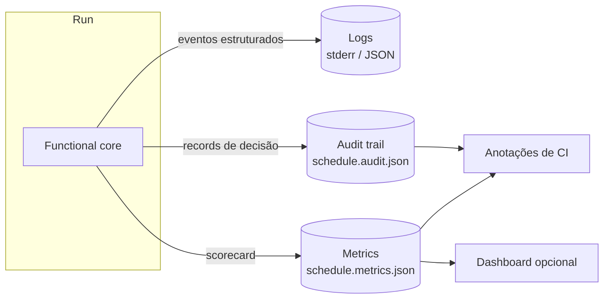
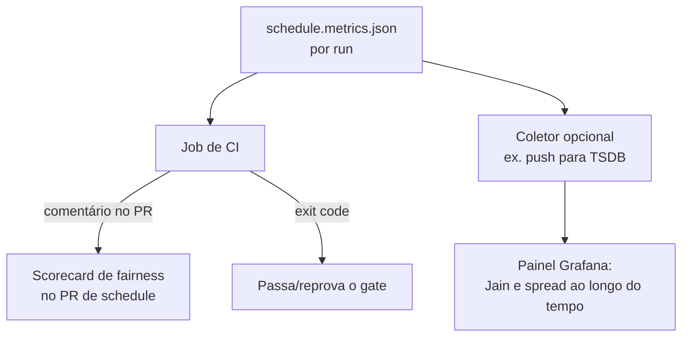

# Observabilidade

> Uma ferramenta batch ainda precisa ser observável — não por uptime, mas por
> **auditabilidade e debuggability**. Quando um boundary parece errado ou um schedule
> parece injusto, você precisa ser capaz de reconstruir exatamente o porquê. Este
> documento define os três sinais (logs, métricas, audit trail) e como se encaixam.

- [1. Filosofia: audit-first](#1-filosofia-audit-first)
- [2. O audit trail (autoritativo)](#2-audit-trail)
- [3. Logs estruturados](#3-logs-estruturados)
- [4. Emissão de métricas](#4-emissão-de-métricas)
- [5. Traces (opcional)](#5-traces-opcional)
- [6. Enquadramento RED / USE](#6-enquadramento-red--use)
- [7. Dashboards e superfície em CI](#7-dashboards-e-superfície-em-ci)

---

## 1. Filosofia: audit-first

A maioria das ferramentas trata logs como o registro de verdade. Aqui o **audit
trail** é autoritativo e machine-readable; os logs são um canal lateral voltado a
humanos. A razão: uma decisão de scheduling precisa ser explicável meses depois ("por
que a rivka ficou de plantão naquela terça?") e essa resposta não pode depender de um
nível de log que por acaso estava ligado.



> Nota de implementação: o build atual emite o **audit trail** e o **metrics JSON**
> (ambos autoritativos e machine-readable) mais um scorecard de console humano.
> Logging estruturado rico (`structlog`, níveis abaixo) é o alvo descrito aqui,
> tracked no [roadmap](ROADMAP.md) — o audit trail é deliberadamente a fonte de
> verdade, não os logs.

## 2. Audit trail

Emitido junto a cada schedule como `schedule.audit.json`. Registra **por que cada
decisão foi tomada**, não só o quê. Dois tipos de record:

**Boundary rationale** — um por restricted interval:

```json
{
  "type": "boundary",
  "member": "rivka",
  "kind": "shabbat",
  "start_utc": "2026-06-12T20:14:05Z",
  "end_utc":   "2026-06-13T21:08:29Z",
  "rationale": {
    "start": {"event": "shkiah", "eve": "2026-06-12", "buffer_min": 18},
    "end":   {"event": "tzais", "shitah": "gra_8.5", "depression_deg": 8.5,
              "fallback": false},
    "location": {"lat": -23.55, "lon": -46.63, "elevation_m": 760}
  }
}
```

**Assignment rationale** — um por shift atribuído:

```json
{
  "type": "assignment",
  "shift": "2026-06-16",
  "member": "rivka",
  "reason": "least_loaded_feasible",
  "load_before": 22.0,
  "load_after": 23.0,
  "alternatives": ["dan(load 24.0)", "alex(load 25.9)"]
}
```

É exatamente o que o `explain-boundary` e o `--explain` renderizam para humanos. Por
ser estruturado, também é **diffável**: dois runs de schedule podem ser comparados
record a record para ver precisamente o que mudou e por quê. Shifts uncovered e
quaisquer soft-relaxation ou backup fills aparecem aqui também, com sua `reason`.

## 3. Logs estruturados

> No build atual, esta é a intenção de design; a saída de console é mínima e o audit
> trail é a fonte de verdade. A tabela abaixo é o alvo.

`structlog`, eventos chave-valor. JSON quando stdout não é TTY (CI), pretty quando é
(local). Nunca `print` cru para logs.

| Nível | Usado para | Exemplo de evento |
|---|---|---|
| `debug` | cálculo de boundary por dia, feasibility por shift | `boundary.computed member=dan date=2026-06-13 end=...` |
| `info` | transições de stage, contagens de resumo | `stage.allocate shifts=90 feasible_pairs=1740` |
| `warning` | fallback de latitude alta, soft relaxation usado, fairness perto do threshold | `zmanim.fallback member=nils date=... reason=no_tzais_solution` |
| `error` | input inviável, shift uncovered, shitah desconhecida | `schedule.uncovered shift=2026-04-13 feasible=0` |

Regras: sem secrets, sem PII além dos member ids que o operador já possui; todo run
compartilha um `run_id` (hash dos inputs + versão) determinístico.

## 4. Emissão de métricas

Todo run escreve `schedule.metrics.json` — a forma máquina do
[scorecard](METRICS.md#8-scorecard-resolvido):

```json
{
  "run_id": "b3f1…",
  "window": {"from": "2026-01-01", "to": "2026-03-31", "days": 90},
  "fairness": {"jain": 1.0, "gini": 0.006, "spread": 1.0, "equity_gap_pct": 1.55},
  "coverage": {"ratio": 1.0, "uncovered": 0, "violations": 0}
}
```

É o que um job de CI ou um dashboard de longo horizonte consome — dá para acompanhar
a fairness ao longo dos trimestres coletando esses arquivos. Todas as definições de
métrica estão em [METRICS.md](METRICS.md); isto é apenas a serialização delas.

## 5. Traces (opcional)

Off por padrão (um run batch não precisa de tracing distribuído). Quando `--trace`
estiver ativo (roadmap), a ferramenta emite spans OpenTelemetry para os stages do
pipeline, para profiling em times grandes. É puramente auxílio de diagnóstico de
performance; nunca afeta a saída.

## 6. Enquadramento RED / USE

Mesmo offline, os enquadramentos clássicos mapeiam de forma limpa e tornam a
ferramenta legível para SREs:

**RED** (tratando um run como um "request"):
- **Rate** — runs por dia (em CI, PRs que mexem no roster).
- **Errors** — exits diferentes de zero, por código (2/3/4/5).
- **Duration** — latência de geração ([budget](METRICS.md#6-métricas-de-performance)).

**USE** (o solver como o recurso restrito):
- **Utilization** — tempo de solver / tempo total do run.
- **Saturation** — houve fallback de exact para heurística? (a virada de regime é o
  sinal de "profundidade de fila").
- **Errors** — inviabilidade / timeout do solver.

## 7. Dashboards e superfície em CI

A ferramenta não traz um dashboard (não tem servidor), mas traz os *dados* para um.
Dois consumidores previstos:



- **Comentário de CI no PR.** Quando rodado como [gate](METRICS.md#7-slos-e-thresholds-do-gate-de-ci),
  a ferramenta imprime o scorecard para que reviewers vejam fairness/coverage antes
  de dar merge numa mudança de roster.
- **Painel de longo horizonte.** Times que querem linhas de tendência canalizam o
  `schedule.metrics.json` para o seu TSDB.

A linha-mestra: **a ferramenta calcula e explica, o stack existente do operador
visualiza.** Nenhum servidor novo para rodar, e todo sinal remonta ao audit trail.
