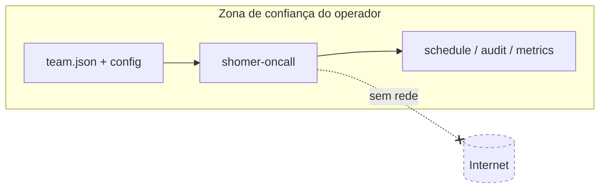

# Segurança e tratamento de dados

> Uma ferramenta batch local e offline tem uma superfície de ataque pequena — mas
> "pequena" não é "nenhuma", e ser explícito sobre isso faz parte de ser profissional.
> Este documento declara o threat model, quais dados a ferramenta toca e a postura de
> supply chain.

- [1. Threat model](#1-threat-model)
- [2. Tratamento de dados e privacidade](#2-tratamento-de-dados)
- [3. Supply chain](#3-supply-chain)
- [4. Validação de input](#4-validação-de-input)
- [5. Reportando uma vulnerabilidade](#5-reportando-uma-vulnerabilidade)

---

## 1. Threat model

Escopo, declarado com clareza para as fronteiras ficarem nítidas.

| Propriedade | Posição |
|---|---|
| **Roda onde** | Na máquina do próprio operador ou num runner de CI. Sem servidor, sem listener, sem superfície de entrada. |
| **Rede** | Nenhuma em runtime. Sem telemetria, sem license check, sem ping de update. O modelo solar é in-house. |
| **Privilégio** | Roda como usuário sem privilégio; lê um JSON, escreve alguns arquivos no diretório de trabalho. |
| **Trust boundary** | O JSON de time e a config são *input confiável* fornecido pelo operador. A ferramenta não se defende de um operador malicioso agendando o próprio time — não é uma ameaça relevante. |

As ameaças realistas **não** são atacantes — são (a) um arquivo de time
malformado/não-confiável causando crash ou exaustão de recursos, e (b) risco de
supply chain nas dependências. Ambos endereçados abaixo.

## 2. Tratamento de dados

- **Que dados existem:** member ids (handles internos do time), locations grossas
  (lat/lon/elevação a nível de cidade), categorias de observância, timezone. Só isso.
- **O que *não* é coletado:** sem nomes, e-mails, telefones ou pager tokens. A
  ferramenta agenda *ids*; mapear um id a uma pessoa vive no pager do operador, não
  aqui.
- **Observância é sensível.** A observância religiosa de um membro é dado pessoal de
  categoria especial sob regimes como GDPR/LGPD. Consequências para o design:
  - A observância fica no arquivo de time controlado pelo operador; a ferramenta
    nunca a transmite para lugar nenhum.
  - Logs e o audit trail referenciam o *efeito* (restricted intervals) e o member id,
    que o operador já detém — ver [OBSERVABILITY §3](OBSERVABILITY.md#3-logs-estruturados).
  - Recomendação nas docs: tratar `team.json` como confidencial e mantê-lo fora de
    repos world-readable. Um membro pode preferir declarar só `observes: [shabbat]`
    sem mais detalhe — o schema permite divulgação mínima.
- **Locations são grossas por design.** Precisão a nível de cidade basta para
  *zmanim*; a ferramenta não precisa nem quer endereços residenciais.
- **Arquivos de saída** (`*.ics`, `*.audit.json`, `*.metrics.json`) herdam a mesma
  sensibilidade do input e são escritos com o umask do processo; as docs aconselham
  restringir suas permissões.

## 3. Supply chain

O conjunto de dependências é deliberadamente **vazio** em runtime
([pyproject.toml](../pyproject.toml)): o calendário hebraico e os *zmanim* solares
são calculados em stdlib puro.

| Controle | Abordagem |
|---|---|
| **Zero deps de runtime** | Nada de terceiros para comprometer o install de runtime. Extras opcionais: `yaml`, `dev`. |
| **Versões pinadas** | As deps de dev usam limites inferiores e são pinadas via lockfile para installs reproduzíveis. |
| **Revisão de dependência** | PRs de Dependabot/renovate são revisados; um bump dispara as [suítes golden + determinism](TESTING.md#4-contrato-de-determinismo). |
| **Superfície mínima** | Sem web framework, sem DB driver. Cada dependência (só de dev) merece seu lugar. |

O contrato de determinismo funciona também como tripwire de supply chain: se uma
dependência de dev atualizada mudar em silêncio um boundary calculado, o teste de
hash committado fica vermelho.

## 4. Validação de input

Todo input externo é validado na fronteira do adapter antes de chegar ao core
([ARCHITECTURE §10](ARCHITECTURE.md#10-cross-cutting-concerns)):

- **Schema** — os models rejeitam campos desconhecidos, tipos errados, lat/lon fora
  de faixa e categorias `observes` desconhecidas.
- **Shitah** — deve resolver no opinion registry; desconhecida ⇒ exit `5`, nunca um
  default silencioso.
- **Window** — `from ≤ to`; ranges absurdos são rejeitados para limitar compute.
- **Location** — parseada estritamente; elevação obrigatória.

Como o core é puro e opera sobre value objects validados, não há superfície de
injeção (sem SQL, sem shell-out, sem eval de template, sem `pickle`).

## 5. Reportando uma vulnerabilidade

Issues de segurança devem ser reportadas de forma privada (ver a política de
segurança do repositório) em vez de issues públicas. Dado o threat model, os reports
de maior valor são: um arquivo de time forjado que trava ou trava a ferramenta, ou
uma preocupação de supply chain numa dependência. Bugs de corretude de domínio seguem
o [caminho normal de bug de domínio](../CONTRIBUTING.md#reportando-bugs-de-domínio).
