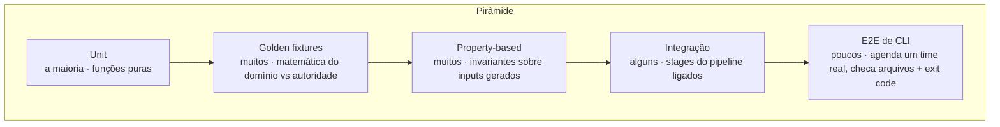
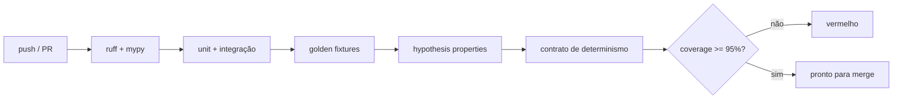

# Estratégia de testes

> Corretude é o atributo de qualidade número um ([ARCHITECTURE §2](ARCHITECTURE.md#2-atributos-de-qualidade-o-que-o-design-otimiza)),
> então a estratégia de testes é estrutural, não um adendo. Três pilares:
> **golden fixtures** (a matemática do domínio está certa?), **property-based tests**
> (as invariantes valem para *todos* os inputs?) e o **contrato de determinismo**
> (mesmo input, mesma saída, sempre).

- [1. Pirâmide de testes](#1-pirâmide-de-testes)
- [2. Golden fixtures](#2-golden-fixtures)
- [3. Property-based tests](#3-property-based-tests)
- [4. Contrato de determinismo](#4-contrato-de-determinismo)
- [5. Unit e integração](#5-unit-e-integração)
- [6. Coverage e CI](#6-coverage-e-ci)
- [7. O que deliberadamente não testamos](#7-o-que-deliberadamente-não-testamos)

---

## 1. Pirâmide de testes

A base é larga porque o core são funções puras - baratas de testar exaustivamente.
Golden e property ficam logo acima do unit porque é onde a corretude de domínio de
fato vive.

## 2. Golden fixtures

A matemática do domínio (datas hebraicas, *zmanim*) é validada contra **fontes
externas autoritativas**, não contra a nossa própria implementação. Uma fixture é um
par `(input → esperado)` congelado com fonte citada. Os anchors do calendário incluem
Rosh Hashanah 5784 = 2023-09-16, Pesach 5784 = 2024-04-23, RH 5785 = 2024-10-03 e
RH 5786 = 2025-09-23; o modelo solar é validado por faixas de plausibilidade (ex.
sunset de Jerusalém no verão em torno de 16:48 UTC) para pegar regressões grosseiras.

**Regra:** fixtures nunca são regeneradas a partir da nossa própria saída. Se a
ferramenta e uma fixture divergem, alguém lê a fonte e decide quem está errado - a
fixture é culpada até prova em contrário, mas o código também. Ver
[CONTRIBUTING](../CONTRIBUTING.md#reportando-bugs-de-domínio).

## 3. Property-based tests

O `hypothesis` gera milhares de times, locations e windows; cada
[invariante de domínio](DOMAIN.md#9-invariantes) é afirmada como uma property que
deve valer para *todo* caso gerado.

| Property | Enunciado |
|---|---|
| **Nenhuma violação** | Para qualquer time/window, nenhum par atribuído `(m,s)` intersecta qualquer interval em `R(m)`. (A invariante de segurança - o teste mais importante do repo.) |
| **Coverage-or-fail** | Todo shift é atribuído exatamente uma vez, ou reportado uncovered com exit ≠ 0. Nunca descartado em silêncio. |
| **Canonicidade de interval** | `R(m)` está sempre sorted, não-sobreposto, não-adjacente após o merge. |
| **tzais monotônico** | Para (location, data) fixos, uma opinião mais stringent gera um `tzais` nunca mais cedo. |
| **Determinismo** | Rodar duas vezes no mesmo input gerado produz schedules idênticos (ver §4). |
| **Fairness ≥ baseline** | O Jain index do allocator é sempre ≥ o de um round-robin ingênuo no mesmo conjunto feasible (nunca piora a fairness). |

Os generators têm seed e encolhem para contra-exemplos mínimos, então uma falha
reporta o menor time/data que quebra a property - que geralmente *é* o bug report.

## 4. Contrato de determinismo

A garantia de destaque: **inputs idênticos produzem saída byte-idêntica.** É um
contrato de primeira classe, forçado, não uma esperança. Marcado `@determinism`.

O que o contrato exige do código:
1. **Sem leitura de relógio de parede no core.** O tempo entra só por um `Clock`
   injetado; os testes usam o `FixedClock` da stdlib. ([ARCHITECTURE §10](ARCHITECTURE.md#10-cross-cutting-concerns))
2. **Nenhuma iteração de set/dict vaza para a saída.** Toda coleção que alimenta um
   resultado é ordenada por uma chave de ordem total antes da serialização.
3. **Solver determinístico.** O greedy usa chaves estáveis `(−w, id)` / `(load, id)`.
   ([ALGORITHMS §5](ALGORITHMS.md#5-alocação))
4. **Serialização estável.** JSON com keys ordenadas, formatação de float fixa,
   quebras `\n`.

Como é testado: rodar o build duas vezes e comparar o `sha256` da serialização (não
"quase igual": bytes idênticos), e comparar contra um hash committado no repo, que
falha alto se um upgrade de dependência ou uma mudança de plataforma perturbar a
saída.

## 5. Unit e integração

- **Unit:** toda função pura - `merge_adjacent`, `feasible`, cálculo de weight, cada
  fórmula de métrica (checada contra valores calculados à mão de [METRICS](METRICS.md)).
- **Integração:** liga os stages reais (calendar → generator → feasibility →
  allocator) sem o CLI shell; afirma properties de estado final em times pequenos
  conhecidos.
- **E2E:** invoca a CLI real em `examples/team.json`, afirma que o `.ics` parseia, que
  o metrics JSON bate com o golden scorecard e que o exit code é `0`. O e2e em modo
  gate afirma os [exit codes](CLI.md#exit-codes) para inputs injetados injustos/uncovered.

## 6. Coverage e CI

| Gate | Requisito |
|---|---|
| Coverage de linha | `≥ 95%` em `src/shomer_oncall` (atual ~96%, 77 testes) |
| Suíte property | verde (nenhum exemplo falsificador) |
| Suíte golden | verde dentro das tolerâncias declaradas |
| Determinismo | byte-idêntico |
| Lint / types | `ruff` limpo, `mypy --strict` limpo |

A CI roda a matriz em Python 3.11, 3.12 e 3.13.

## 7. O que deliberadamente não testamos

- **Corretude interna de bibliotecas de terceiros.** Não usamos nenhuma em runtime;
  o calendário e a astronomia são in-house e validados por golden fixtures contra
  autoridades independentes.
- **Micro-benchmarks como pass/fail.** Performance tem budgets ([METRICS §6](METRICS.md#6-métricas-de-performance))
  reportados em CI, mas um run lento é `warning`, não build vermelho - corretude
  nunca fica refém de um threshold de tempo ruidoso.
- **A plataforma de paging.** Os adapters de export são testados por formato de saída
  válido; o pager downstream está fora de escopo ([ROADMAP](ROADMAP.md)).
